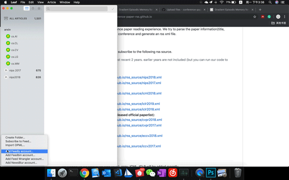
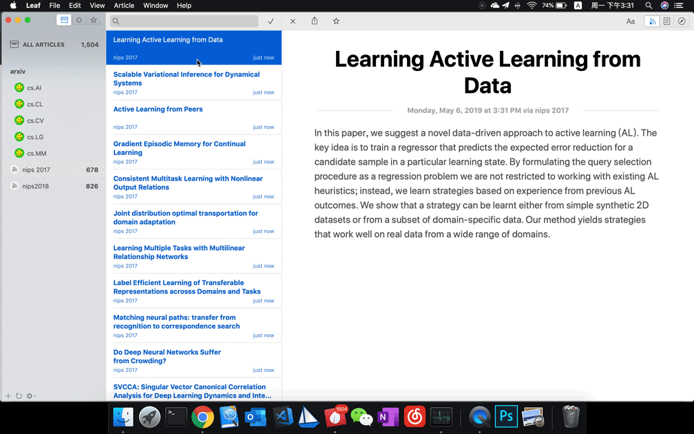

# Conference Paper Reading RSS.

This is a simple repo for improving (**computer science**) conference paper reading experience. We try to parse the paper information(title, abstract, url) of all the papers for a certain conference and generate an RSS XML file. You can subscribe our resource to read papers with your **PC/PAD/PHONE** as long as you have an RSS reader on it.

## Usage

You can use **any RSS reader** to subscribe our resource. In Mac, we recommend using [Leaf](https://itunes.apple.com/cn/app/leaf-rss-%E6%96%B0%E9%97%BB%E9%98%85%E8%AF%BB%E5%99%A8/id576338668?mt=12)(**NOTE: most of the emails also support RSS subscription, just Goole it**. btw, use [feedDemon](http://www.feeddemon.com/) for windows as suggested by [charlesliucn](https://github.com/charlesliucn)). If you are using Leaf, it should look like follows:

### First, subscribe to the resource:



### Second, enjoy reading:


### rss source
Use any rss reading client (Leaf in Mac) to subscribe to the following rss resource.
> Currently, we parse papers from the most recent 2 years. earlier years are not included (but you can run our code to parse it by yourself).
+ NIPS:
  + https://CPR-RSS.github.io/rss/nips2019.xml
  + https://CPR-RSS.github.io/rss/nips2018.xml
  + https://CPR-RSS.github.io/rss/nips2017.xml
+ ICML:
  + https://CPR-RSS.github.io/rss/icml2020.xml
  + https://CPR-RSS.github.io/rss/icml2019.xml
  + https://CPR-RSS.github.io/rss/icml2018.xml
+ ICLR:
  + https://CPR-RSS.github.io/rss/iclr2021.xml
  + https://CPR-RSS.github.io/rss/iclr2020.xml
  + https://CPR-RSS.github.io/rss/iclr2019.xml
  + https://CPR-RSS.github.io/rss/iclr2018.xml
+ CVPR:
  + https://CPR-RSS.github.io/rss/cvpr2020.xml
  + https://CPR-RSS.github.io/rss/cvpr2019.xml
  + https://CPR-RSS.github.io/rss/cvpr2018.xml
  + https://CPR-RSS.github.io/rss/cvpr2017.xml
+ ECCV:
  + https://CPR-RSS.github.io/rss/eccv2020.xml
  + https://CPR-RSS.github.io/rss/eccv2018.xml
+ ICCV:
  + https://CPR-RSS.github.io/rss/iccv2019.xml
  + https://CPR-RSS.github.io/rss/iccv2017.xml
+ interspeech(@[charlesliucn](https://github.com/charlesliucn))
  + https://CPR-RSS.github.io/rss/interspeech2017.xml
  + https://CPR-RSS.github.io/rss/interspeech2018.xml
+ arXiv:
  + I also upload my [arXiv Leaf subscription](https://github.com/paper-gem/paper-gem.github.io/blob/master/Leaf%20Subscriptions.xml) for those lazy guys (Just import it in your Leaf client).

## Dependency
The whole repo is built on `python3`. In this section, we introduce how to run this code locally. This code mainly depends on `requests`, and [`selenium`](https://www.selenium.dev/documentation/en/webdriver/). Most of the dependencies in this project could be installed via `pip`, except that `selenium`  furtherly requires installing an extra webdriver (`chromedriver` as in the code. You have to install the webdriver locally and put it into your system path).

To run the cod, following the following command:
```shell
python3 main.py -c CONFERENCENAME -y YEAR
```

## Other

1. call for proposals (any suggestion for new conferences, or other interesting functions.)
2. call for pulls of other conference.
3. pull request: (please make sure that your pull requests meet the following requirement)
    1. satisfies the [python style guide](https://www.python.org/dev/peps/pep-0008/) (The only exception is the Maximum Line Length. In this project, the maximum line length is 100 rather than 80.)
---

## Update

### 2021.2.11 update plan

* [x] rename and reconstruct this repo
* [x] renaming: find new name for this repo;
* [x]reconstructing: build parser template based on different website rather than conference.
* [ ]more works:
  * [ ] build the website;
  * [ ] generate the lda wordcloud.

### reconstruction

* [x] https://www.thecvf.com/ (for cvpr / iccv)
* [x] https://www.ecva.net (for eccv)
* [x] http://proceedings.mlr.press/ (for icml)
* [ ] https://proceedings.neurips.cc/ (for nips / neurips)
* [x] https://openreview.net/ (for iclr)
* [ ] arxiv rss dynamic parser (TODO)
